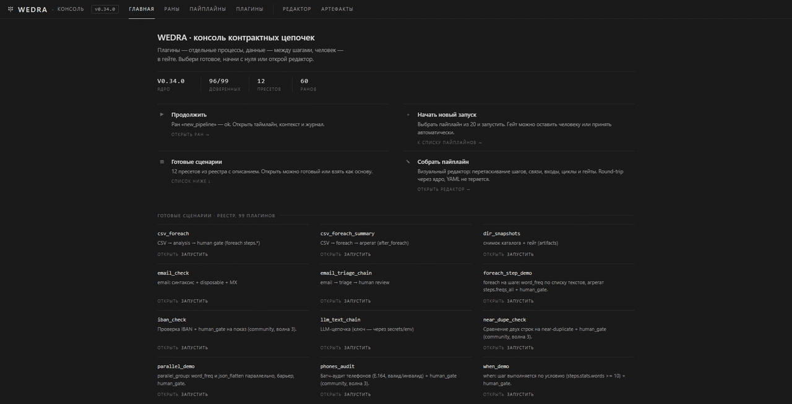
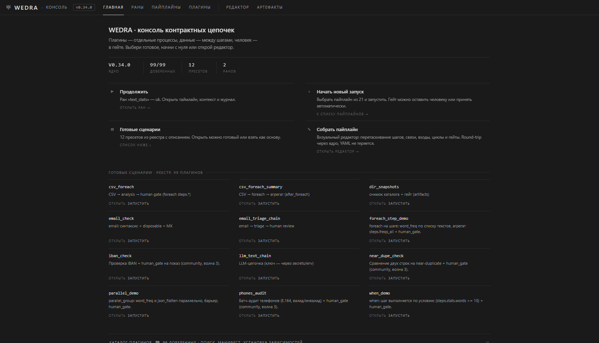
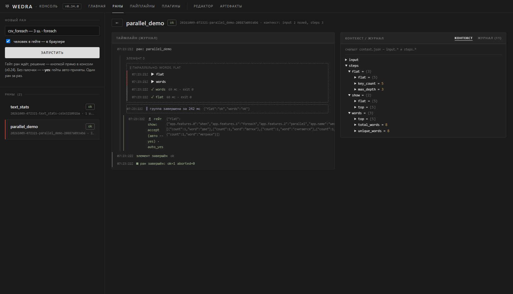
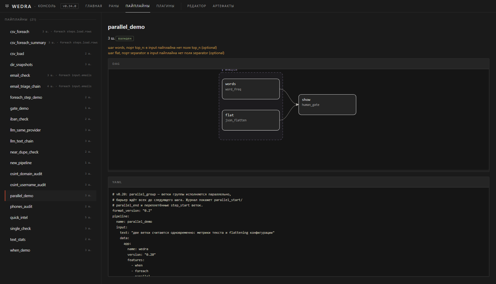
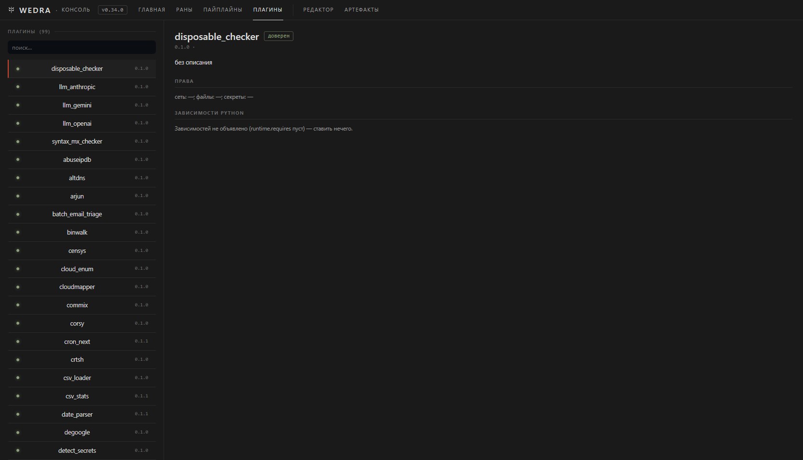
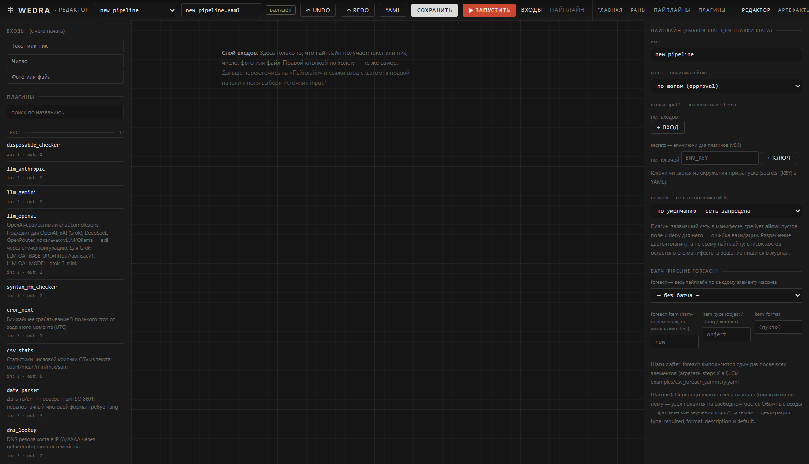

[English](README.en.md) | Русский

# WEDRA

**Собери плагины в локальную цепочку. Запусти один раз — получи результат.**

WEDRA запускает плагины разных авторов в одном локальном пайплайне и передаёт данные между шагами. Она не заменяет сами инструменты: вместо запуска нескольких CLI по очереди и ручной склейки вывода ты описываешь цепочку и запускаешь её одной командой.

```text
плагин A → плагин B → плагин C → результат
```

Результаты отдельных шагов остаются в журнале запуска — посмотреть его потом можно командой `wedra runs show <run_id>` (список: `wedra runs list`). Если нужна сводка или отчёт, добавь в цепочку форматтер: WEDRA не нормализует произвольный вывод автоматически.

Консоль запускается командой `wedra gui`: раны с таймлайном, пайплайны с DAG, каталог плагинов и визуальный редактор.



Полный обзор консоли — длинное демо в [`docs/demo.gif`](docs/demo.gif).

## Попробовать

Собери бинарник из исходников (нужен Go 1.26+). Из корня репозитория:

```bash
go build -o wedra ./cmd/wedra
./wedra demo
```

Готовые сборки есть на странице [Releases](https://github.com/wykserdex/wedra/releases), но только для опубликованных версий (см. раздел «Релизы» ниже).

Демо работает без Git, Python и сети и проверяет, что WEDRA запускается. Оно использует встроенные модули, а не стороннюю цепочку плагинов. На Windows бинарник называется `wedra.exe` — команды ниже те же, `./` не нужен.

## Найти и поставить плагин

В репозитории и в реестре — 99 плагинов, из них большинство community.

```bash
./wedra plugin list                      # все доступные
./wedra plugin search ssl                # поиск по названию и описанию
./wedra plugin install sherlock          # поставить из реестра
./wedra pipeline install email_check     # готовый пресет вместе с плагинами
```

**Важно:** плагин — это обёртка над внешним инструментом, и сам инструмент ставится отдельно. Например `plugin install sherlock` кладёт в репозиторий обёртку, но чтобы она заработала, нужен сам CLI:

```bash
pip install sherlock-project
```

Пока инструмент не установлен, плагин честно отдаёт доменную ошибку `<имя>_not_installed` с командой установки, а не падает. Требования каждого плагина перечислены в его `README.md`.

## Что даёт WEDRA

- **Один повторяемый запуск.** Порядок шагов и связи между ними описаны в YAML.
- **Контракт на границе плагина.** Плагины запускаются отдельными процессами; их входы и выходы проверяются.
- **Выбор способа получить итог.** Смотри вывод шагов или добавь явный плагин-форматтер.
- **Контроль человека — по необходимости.** Добавь `core/human_gate`, если перед продолжением нужен просмотр и решение.
- **MCP — дополнительно.** Агент может вызывать инструменты WEDRA через MCP; для обычного локального запуска MCP не нужен. Подробности — в [документации MCP](docs/mcp.md).

| Поверхность | Инструменты |
|---|---|
| Агенты (MCP) | 8 инструментов: `list_plugins`, `describe_plugin`, `validate_pipeline`, `plan_pipeline`, `run_pipeline`, `get_run`, `cancel_run`, `exec_plugin` (выключен по умолчанию) |

## Пример пайплайна

```yaml
format_version: "0.2"
pipeline:
  name: example
  input:
    text: "hello world hello"
  steps:
    - id: stats
      plugin: plugins/community/text_analyzer
    - id: review
      plugin: core/human_gate
      form:
        - { field: steps.stats.words, editable: false }
      actions: [accept, reject]
```

Проверь описание до запуска, затем выполни пайплайн:

```bash
./wedra pipeline validate pipeline.yaml
./wedra pipeline run pipeline.yaml
```

Шаг `review` ждёт твоего решения — напечатай `a`, чтобы принять, или `r`, чтобы отклонить. В пайплайне или CI, где ввода нет, добавь `--yes`, чтобы принять всё автоматически. `--no-auto-approve` — обратное: гейт будет ждать человека, и без ввода ран на нём остановится.

Полный формат пайплайна и готовые примеры — в [быстром старте](docs/quickstart.md) и в [`examples/`](examples/).

## Скриншоты

| | |
|---|---|
|  |  |
| **Главная** — что запустить дальше | **Ран** — таймлайн шагов, live-журнал и контекст |
|  |  |
| **Пайплайн** — YAML, DAG и валидация до запуска | **Плагин** — права, зависимости, контракт |
|  | |
| **Редактор** — сборка цепочки перетаскиванием, round-trip через ядро | |

## Релизы

Стабильные сборки — в [GitHub Releases](https://github.com/wykserdex/wedra/releases):
`wedra-{linux,darwin,windows}-{amd64,arm64}`, legacy `tool-*`, `wedragui-windows-*.exe`,
conformance-пакет, `SHA256SUMS`, SBOM (`sbom.spdx.json`) и build provenance.
Тег релиза (`vX.Y.Z`) совпадает с [`VERSION`](VERSION) — сейчас `0.34.0`;
protocol version — [`protocol/VERSION`](protocol/VERSION) (`0.2`), версии независимы.
Версия 0.34.0 ещё не выпущена: тега v0.34.0 и готовых бинарников пока нет, см. [CHANGELOG](CHANGELOG.md).

## Безопасность и статус

Плагины — исполняемый код: локальный запуск сам по себе не делает их безопасными. Проверяй источник плагина и ограничения запуска; подробности — в [модели безопасности](SECURITY.md).

Объявленная сеть плагина — это либо весь интернет (`any_host: true`), либо отсутствие сети. Фильтра по конкретным хостам нет ни на одной платформе (см. [SECURITY.md](SECURITY.md#egress-filtering-proxy-built-kernel-enforcement-still-missing)). Изоляция внешнего кода (`sandbox: untrusted`) есть только на Linux (bubblewrap); на Windows и macOS такой код не запускается. WEDRA находится в активной разработке версии 0.x, поэтому интерфейс и формат могут меняться.

- [Быстрый старт](docs/quickstart.md)
- [Плагины и их создание](docs/plugin-dev.md)
- [Формат пайплайна](protocol/v0.2/PROTOCOL.md)
- [Участие в проекте](CONTRIBUTING.md) · [Governance](GOVERNANCE.md)
- [Сообщить об ошибке или предложить плагин](https://github.com/wykserdex/wedra/issues)
